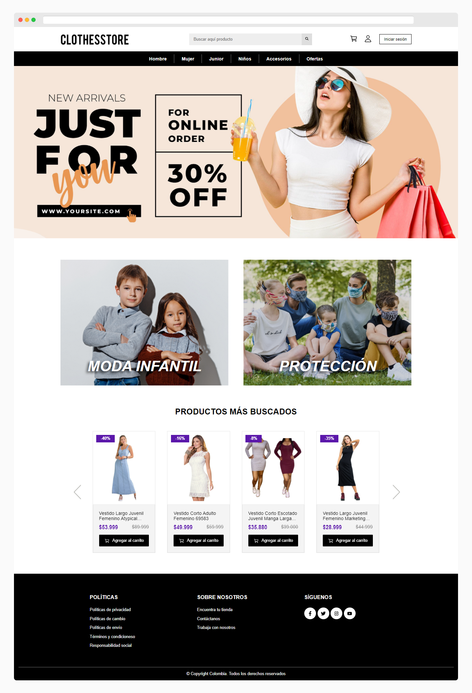

# e-commerce Clothes | Mercado Libre 👧

Consumo de api de [Mercado Libre](https://developers.mercadolibre.cl/es_ar/api-docs-es)

## Demo 🚀

[View Demo](https://yadurani.github.io/ecommerce-clothes/)

## Tools 🚀

- React.js
- Redux Toolkit
- Redux Persist
- Styled Components

## Installation 🛴

Clone la app

```bash
git clone https://github.com/yadurani/ecommerce-clothes.git
```

Instale las dependencias

```bash
yarn install 'or' npm install
```

Corra el proyecto

```bash
yarn start 'or' npm run start
```

## Overview 🔖


